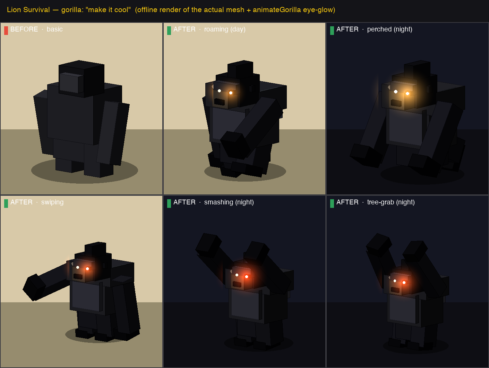

# Dossier — gorilla render upgrade (more detail + per-state animation)

**Date:** 2026-06-17
**Trigger:** Steven — *"can you make the gorilla more detailed."*
**Scope:** visuals only. No FSM / [retaliation](gorilla_retaliation_2026-06-17.md) / tree-grab /
wall-smash / day-night / Raw-Signals changes. All edits in `index.html`.

## Before

The gorilla was ~8 flat boxes in two tones (one fur colour + a near-black face/brow): a barrel torso,
hips, a plain head cube, a brow slab, two stub arms and two stub legs. From any distance it read as a
dark blob — bigger than a lion, but not obviously a *gorilla*. Limb animation was a single shared
`sin` swing (arms rotated about their own centre; legs bobbed on `position.y`), identical in every
state — a swipe looked the same as a stroll.

## After — mesh (`makeGorilla`)

Rebuilt as **22 flat-shaded boxes** on a 7-tone palette, scale **1.28 → 1.32** (≈1.5× a lion's
footprint, to sell the weight). All meshes stay flat under the group (limbs one level under a
shoulder/hip pivot) so the shared hit-flash still recolours every piece — see *Integration* below.

| Region | Detail added |
|---|---|
| Core | barrel torso over heavy hips, **hunched shoulder yoke**, **lit chest plate** (lighter front tone), **grey silverback saddle** on the back (the signature marking) |
| Head | low & forward off the shoulders; **sagittal crest** (domed skull), **heavy brow ridge**, deep-set eyes, **jutting paler muzzle**, dark nostril pad, small set-back ears |
| Arms | long **knuckle-walkers** on shoulder pivots, dark knuckle pad at the wrist |
| Legs | short stout thighs on hip pivots, dark planted feet |

Palette: coat `#2b2b32`, silverback saddle `#53535e`, chest plate `#3a3a44`, face/skull `#141418`,
brow `#303038`, muzzle `#47403a`, hands/feet/eyes `#0c0c10`.

## After — animation (`animateGorilla`)

Arms and legs are now **pivot Groups** (geometry `translate()`d so the box hangs from the
shoulder/hip), so one `rotation.x` swings the whole limb from the joint instead of spinning a box
about its middle. The function became a small **pose controller** keyed on `G.state` / `G.phase`,
with combat poses driven straight off each action's wind-up clock (`G.actionTimer` vs the `GOR.*`
timings) so the tell you see is the hit that lands:

| State | Pose | lead-arm `rot.x` (sampled) | leg `rot.x` |
|---|---|---|---|
| roaming / pursuing / engaging-rush | hunched knuckle-walk, arms lead & plant forward, legs at half amplitude | −1.10 (mid-stride) | −0.38 |
| perched | tucked crouch up the tree | −0.57 | +1.09 |
| sleeping | same fold + slow breathing bob | −0.52 | +1.15 |
| engaging · swing (**swipe**) | rear the lead arm back through the wind-up, slash across on the strike | −1.27 → −0.67 (+z cross) | +0.12 |
| smashing (**wall**) | both arms hoist overhead, then hammer down | −2.29 (overhead) | +0.10 |
| treegrab | both arms reach straight up into the canopy | −2.52 (+z splay) | −0.12 |

The default branch keeps the static hunch (head low, shoulders high) so a knuckle-walker reads even
when standing; the perched fold eases in (so walking *to* a perch still strides, `gait ≥ 0.25`).

## Integration (what would have broken, and didn't)

- **Hit-flash** iterates the mesh to swap every part to the shared `FLASH_MAT` and back via
  `userData.origMat`. The new arm/leg pivots add a level of nesting, so the gorilla's two flash spots
  (origMat capture in `makeGorilla`, swap in `updateGorillas`) moved from `.children.forEach` to
  `.traverse` — every one of the 22 meshes flashes and restores.
- **Day/night** only scales scene lighting (ambient/sun), never per-mesh materials — untouched.
- **VRAM**: `disposeObject3D` already traverses, so the extra boxes free cleanly on death; `GOR.MAX = 2`
  caps the count. Per frame only ~8 pivot rotations update — no geometry rebuilds.

## Verification

The headless preview browser reports a **WebGL2 context with no functional GL backend** — a raw
`gl.clear` to red reads back `[0,0,0,0]`, so the live three.js scene can't be screenshotted here.
Verified two ways instead:

1. **Programmatic (in-page).** `makeGorilla` → 22 meshes, **0 missing `origMat`**, arms/legs = 2/2,
   scale 1.32. Flash via traverse swaps **all** meshes to white and restores **all**. Each of the six
   states yields a **distinct** limb pose (table above). The real `updateGorillas` ran **400 frames
   across day↔night with a lion pressed in — zero exceptions**; a focused test confirmed the real FSM
   still enters **engaging** (territorial) and **retaliation** (locks onto the biter), and **pursuing**
   (player). FSM transition code was never touched — only mesh, poses, flash and scale.
2. **Faithful offline render** — `render_gorilla_compare.py` projects the *exact* box geometry and the
   *exact* `animateGorilla` angles (painter's algorithm + Lambert shading matching the in-game
   directional light) into `gorilla_render_upgrade.png` (the image above). It's the actual mesh data,
   not a mock-up.

---

## "Make it cool" pass (same day)

**Trigger:** Steven — *"make it look cool."* Not just detailed — visually striking, intimidating, the
most distinctive entity on screen. The image at the top is from this pass.

### Glowing eyes (the signature)
The headline addition: **emissive eyes + an additive glow halo** that make the gorilla read at a glance
and feel menacing — especially as *two burning eyes in the dark* when it's night-perched in a tree.

- Each eye is a small `MeshLambertMaterial` with an `emissive` colour (glows regardless of lighting),
  fronted by an additive `PlaneGeometry` halo (`gorGlowTexture()` — a shared white radial sprite the
  halo tints). Both opt out of the hit-flash (`userData.noFlash`) so the **eyes keep burning even as
  the body flashes white on a hit**; the flash loop now skips `noFlash` meshes.
- `animateGorilla` drives the glow each frame from `G.state` + day/night — amber at rest, **red-hot**
  when aggressive, dim embers asleep, and cranked ×1.5 at night. A pulse clock adds a slow breathe at
  rest and a fast throb in combat. Smoothed via `G.eyeI` so it flares/fades rather than snapping.

  | State | Eye emissive (verified) | Halo opacity | Feel |
  |---|---|---|---|
  | sleeping (night) | `45290d` | 0.38 | dim embers |
  | roaming (day) | `88511b` | 0.57 | watchful amber |
  | perched (night) | `ffa135` | 0.94 | **blazing amber in the canopy** |
  | engaging (day) | `cb450e` | 0.75 | red-hot |
  | smashing (night) | `ff5d13` | 0.95 | **rage** |

  Halo colour shifts amber→red with aggression; the additive blend is sized to read as eyes, not a torch.

### Bolder, more imposing silhouette
- **Heavy V-taper**: deeper barrel torso, **broad shoulder yoke** (2.12 wide), **narrow hips** (1.16) —
  reads as raw power. Scale **1.32 → 1.36** (towers over the pride). Longer/thicker knuckle-walk arms
  (2.05) with bigger dark knuckle pads; bigger planted feet; taller sagittal crest + heavier brow.
- **Two-tone coat** for dramatic shading: lit upper body (`#26262c`) vs **shadowed limbs/underside**
  (`#191920`), so the arms and legs recede and the chest/shoulders catch the light.
- **Brighter silverback saddle** (`#6a6c7c`) with a **silver sheen strip** (`#9aa0b2`) along its top —
  the iconic mark now actually pops instead of hiding in the dark coat.
- **Battle scar**: a pale slash (`scarMat`, rotated `-0.7`) across one brow — a memorable asymmetry.

Mesh count 22 → **28** (still 2-cap'd, only ~8 pivot rotations + a handful of material mutations per
frame). Re-verified: 28 meshes, 0 missing `origMat`, **4 `noFlash`** (2 eyes + 2 halos), scale 1.36;
flash recolours the 24 body meshes and leaves all 4 eye/halo meshes burning; each state yields a
distinct eye colour/intensity (table above); the real `updateGorillas` ran 400 frames day↔night with a
lion pressed in — **zero errors**.
